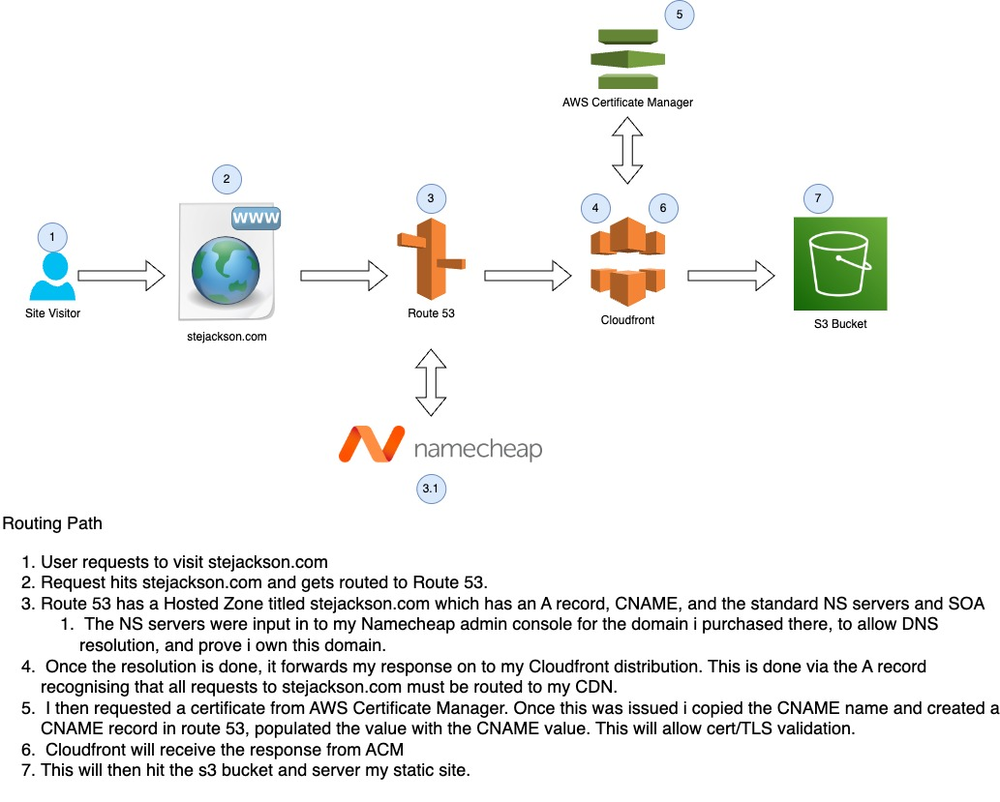

# Site Build

Here you will find out how i built the site. It should contain some useful links, alongside an architecture diagram!

Websies used to create:

* [Initial Project Guide](https://loganmarchione.com/2022/10/the-best-devops-project-for-a-beginner/)

* [Guide Followed To Create Site](https://dev.to/aws-builders/guide-to-hosting-a-static-website-on-aws-using-s3-cloudfront-and-route53-with-just-7-steps-220b)

* [Namecheap Domain Registrar](https://www.namecheap.com/)

* [Static Site Generator](https://www.mkdocs.org/)

    * Site Theme: [Cinder](https://sourcefoundry.org/cinder/)

* [Hosted Zone Help](https://medium.com/weekly-webtips/how-to-integrate-3rd-party-domain-names-with-aws-route-53-for-your-website-webapp-7f6cd8ff36b6)

* [Namecheap AWS DNS Help](https://www.namecheap.com/support/knowledgebase/article.aspx/10371/2208/how-do-i-link-my-domain-to-amazon-web-services/)

Routing Diagram:
